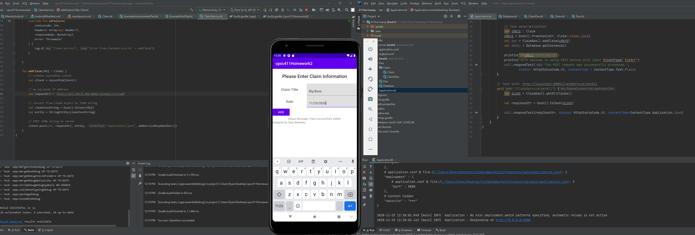
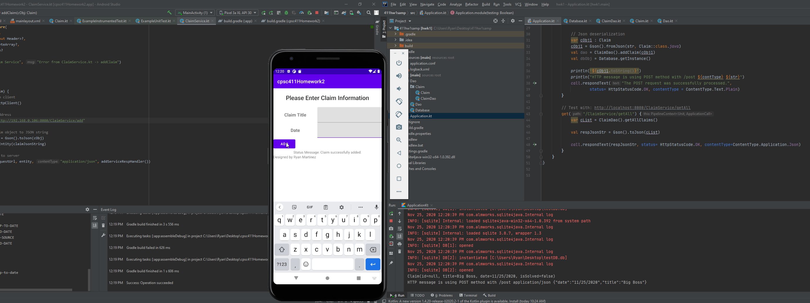

# Homework Assignment #2 CPSC 411 Mobile Development

created by Ryan Martinez

## Preview of project execution

## Instructions to run:
- Load up html server to catch the html requests
- Load up the android project
- Fill in the fields
- Click the Add button